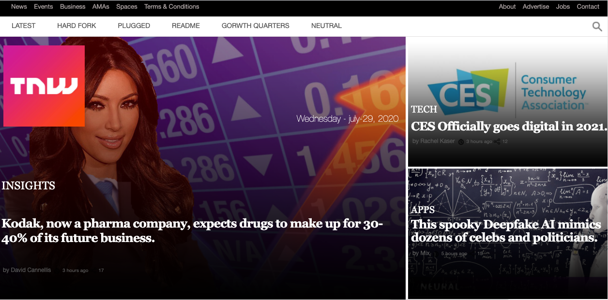

# BUILDING WITH RESPONSIVE DESIGN

Building an HTML and css page that matches the appearance of this page [The NextWeb](https://thenextweb.com/)

# Built With

- [HTML](https://developer.mozilla.org/en-US/docs/Web/HTML)
- [CSS](https://www.w3schools.com/css/)
- [Fontawesome](https://fontawesome.com/)

# Original Page

  

# Live Demo
[Click here for Live Demo](https://raw.githack.com/t-yanick/building-with-responsive-design/nextweb/index.html)

# Getting Started

# Authors

### Bbosa Muhamood
- Github: [@bmuhamood](https://github.com/bmuhamood)
- Twitter: [@croixtechfirm](https://twitter.com/croixtechfirm)
- Linkedin: [Bbosa Muhamood](https://www.linkedin.com/in/bbosa-muhamood-06845576/)

### Tazoh Yanick Tazoh
- Github: [@t-yanick](https://github.com/t-yanick)
- Twitter: [@ElTazoh](https://twitter.com/ElTazoh)
- Linkedin: [Tazoh Yanick](https://linkedin.com/in/tazoh-yanick-5a978764)

# Contributing
Contributions, issues and feature requests are welcome!
Feel free to check the [issues page](https://github.com/t-yanick/building-with-responsive-design/issues).

# Show your support
If you like our work, please give us a :+1:

# Acknowledgments
- Microverse
- W3schools
- Freecodecamp
- Developer.mozilla
- Learnshayhowe
- Odin project

# License
This project is [MIT](https://opensource.org/licenses/MIT) licensed.